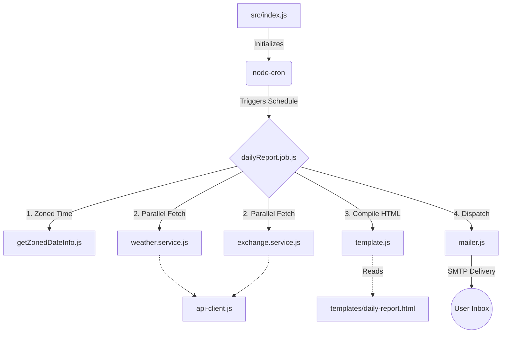

# NodeProj: Morning Email Scheduler ☀️

A modular, resilient Node.js background application that automatically aggregates weather data and exchange rates, formats them into a beautiful HTML template, and emails a daily morning digest precisely on schedule.

## 🏗️ Architecture & Flow

The application is built using a strict separation of concerns. Services handle API connectivity, jobs handle orchestration, and templates handle the presentation layer.



## 📁 Project Structure

```text
src/
├── configs/
│   └── app-config.js          # Auto-validates environment variables on boot
├── dates/                     # Pure mathematical date and timezone utilities
├── scheduler/
│   ├── jobs/
│   │   └── dailyReport.job.js # The core orchestration script
│   ├── templates/             # Raw HTML views
│   ├── utils/                 
│   │   └── logger.js          # Timestamped formatting logger
│   ├── mailer.js              # Nodemailer SMTP singleton
│   ├── scheduler.js           # Wraps jobs in node-cron definitions
│   └── template.js            # Injects dynamic variables into raw HTML
└── services/                  # External API integration points
```

## ⚙️ Environment Configuration

To run this application, you must provide the necessary credentials for the SMTP mail server and the external APIs. 

Create a `.env.dev` (and `.env.prod`) file in the root directory:

```env
# ====== Email Credentials ======
# The email address that the scheduler will send FROM and TO
USERNAME="your_email@gmail.com"
PASSWORD="your_app_specific_password"

# ====== NodeMailer SMTP Configuration ======
SMTP_HOST="smtp.gmail.com"
SMTP_PORT=587

# ====== Scheduling & Localization ======
# Standard Cron Expression (e.g., 20 17 * * * for 5:20 PM)
CRON_SCHEDULE="0 9 * * *"
TIME_ZONE="Asia/Jerusalem"

# ====== External APIs ======
WEATHER_API_URL="https://api.open-meteo.com/v1/forecast?latitude=32.08&longitude=34.78&current_weather=true"
EXCHANGE_RATE_API_URL="https://api.exchangerate.host/latest?base=USD&symbols=ILS"

# ====== Application Settings ======
LOG_LEVEL="info"
RETRY_DELAY=2000
```

> **Note:** If any of these variables are missing, the application configuration (`configs/app-config.js`) will intentionally throw an error and fail to boot to prevent silent failures later.

## 🚀 Available Scripts

Run these commands using `npm run <command>`:

- **`dev`**: Starts the main scheduler using variables loaded from `.env.dev`.
- **`prod`**: Starts the main scheduler using variables loaded from `.env.prod`.
- **`test`**: Executes the Vitest suite across all unit tests.
- **`format`**: Uses Prettier to format all `.js` files within the `src/` directory.
- **`test-email`**: Immediately triggers the email pipeline manually (bypassing the alarm clock) using development variables. Excellent for verifying SMTP credentials.
